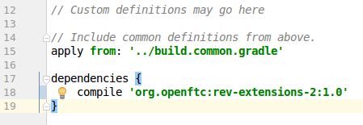

# RevExtensions2

The successor to REV Extensions

**NOTE: SDK v4.x is required to use this**

**NOTE: an OpenRC-based SDK is NOT required to use this**

**NOTE: scroll down for installation instructions**

### DISCLAIMER:

Use this at your own risk. **You accept the possibility that using these extra features may cause the SDK to implode and cause you lose F-3 at worlds.**
That being said, I used a few of these features in competition this past season without any issues.

## What extra functionality does this add to the SDK?

 - Setting the LED color on the Hub
 - Setting the speed of the I2C buses on the Hub
 - Querying for total module current draw
 - Querying for servo bus current draw [ **broken:** REV firmware bug ]
 - Querying for GPIO bus current draw
 - Querying for I2C bus current draw
 - Querying for individual motor channel current draw
 - Reading the 5v monitor
 - Reading the 12v monitor
 - Queying for the internal temperature inside the Hub [ **broken:** unknown units ]
 - Query whether the Expansion Hub is in an over-temp condition
 - Query whether each individual motor H-bridge is over-temp
 - Query whether phone charging is enabled [ **broken:** REV firmware bug ]
 - Enable or disable phone charging
 - Setting servo pulse width directly in microseconds
 - Reading certain data in bulk from the Hub (can increase your control loop speed)
     
     The following data can be read in one go:

     - All 4 encoder counts
     - All 4 encoder velocities
     - All digital pins
     - All all analog pins
     - Is motor at target position for all 4 motors

 - Query whether a motor has "lost counts" [ **broken:** no idea what this actually does ]
 - Query for which firmware version the Hub has installed
 - Query for which hardware revision the Hub is

## How do I install this?

1. Open your FTC SDK Android Studio project
2. Open the `build.common.gradle` file:

    

3. Add `jcenter()` to the `repositories` block at the bottom:

    

4. Open the `build.gradle` file for the TeamCode module:

    

5. At the bottom, add this:

        dependencies {
            compile 'org.openftc:rev-extensions-2:1.0'
         }

    When you've done that, the bottom of the file should look like this:

    

6. Now perform a Gradle Sync:

    

7. Wait for Gradle to finish gradling

8. Congratulations! You are now ready to use the new features provided by REV Extensions 2!

## Ok now that I've installed it, how do I use this?

Please see the [examples](examples/src/main/java/org/openftc/revextensions2/examples) folder. More detailed documentation coming soon.

## Changelog

### v1.1

 - Fix compatibility with SDK v4.x (due to API breaking changes, older versions of the SDK are no longer supported)
 - Fix `RevBulkData.getMotorCurrentPosition()` and `RevBulkData.getMotorVelocity()` to return the value signed to be consistent with `DcMotor.getMotorCurrentPosition()` and `DcMotorEx.getVelocity()`
 - Correct typo in `CurrentMonitorsExample.java`
 - Don't ignore reflection exceptions
 - Add JavaDoc comments to `RevBulkData.java`
 - Refactor hotswapping slightly

### v1.0

 - Initial release